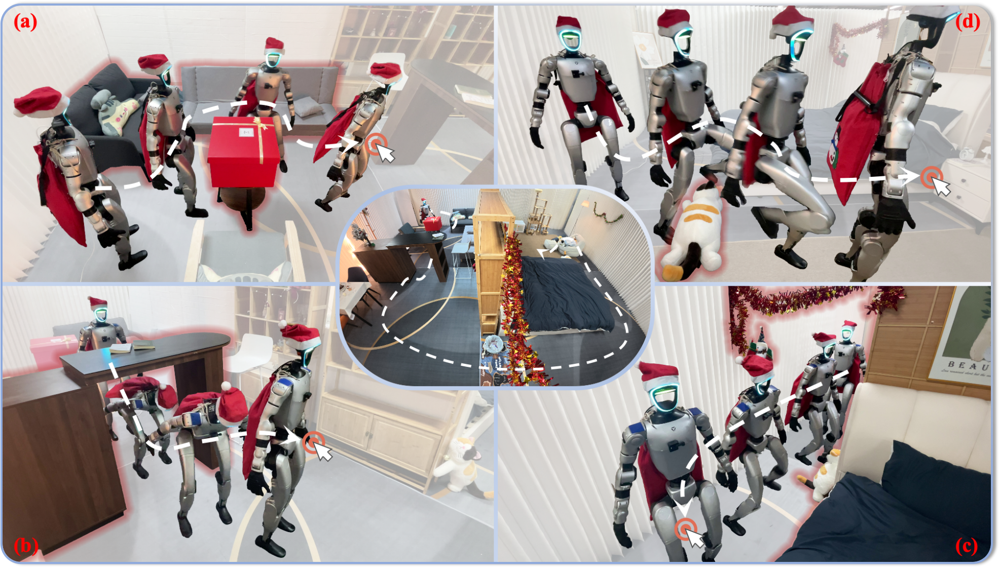
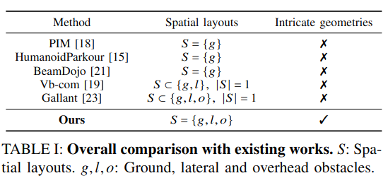

<div align="center">  
  <h1 align="center">  Click and Traverse </h1>
  <h3 align="center"> Tsinghua · GALBOT </h3>

[中文](README_zh.md) | [English](README.md)

:page_with_curl:[Paper](https://arxiv.org/abs/2601.16035) | :house:[Website](https://axian12138.github.io/CAT/) | :film_projector:[Video](https://www.youtube.com/watch?v=blek__Qf0Vc)
</div>

This repository provides the **official implementation** of the paper:

> **Collision-Free Humanoid Traversal in Cluttered Indoor Scenes**  
> *Han Xue et al.*  
> arXiv preprint: [arXiv:2601.16035](https://arxiv.org/abs/2601.16035).<br>
> project page: [https://axian12138.github.io/CAT/](https://axian12138.github.io/CAT/).


The project addresses the problem of enabling humanoid robots to safely traverse **cluttered indoor scenes**, which we define as environments that simultaneously exhibit:

- **Full-spatial constraints**: obstacles jointly present at the *ground*, *lateral*, and *overhead* levels, restricting the humanoid’s motion in all spatial dimensions.
- **Intricate geometries**: obstacles with complex, irregular shapes that go beyond simple primitives such as rectangular blocks or regular polyhedra.

<p align="center">
  
  
</p>

In this repository, we present:

- **Humanoid Potential Field (HumanoidPF)**: a structured representation encoding spatial relationships between the humanoid body and surrounding obstacles;
- **Hybrid scene generation**: realistic 3D indoor scene crops combined with procedurally synthesized obstacles;
- **Reinforcement learning for specialist and generalist policies**, respectively trained on specific scenes and distilled to a generalist policy.

<p align="center">
  
</p>

## Table of Contents

- [Project Status](#project-status)
- [Installation](#installation)
- [Repository Structure](#repository-structure)
- [Hybrid Obstacle Generation & HumanoidPF](#hybrid-obstacle-generation--humanoidpf)
- [Traversal Skill Learning](#traversal-skill-learning)
- [Citation](#citation)
- [License](#license)
- [Contributing](#contributing)
- [Acknowledgement](#acknowledgement)
---

## Project Status

- [x] 🧩 Procedural obstacle generation and HumanoidPF construction
- [x] 🧩 Specialist policy training code
- [x] 🗂️ Pre-trained specialist models and scene data
- [ ] 🧩 Specialist-to-generalist policy distillation code
- [ ] 🗂️ Pre-trained generalist models
- [ ] 🗂️ Expanded scene datasets
- [ ] 🚀 Sim-to-real deployment utilities

---

## Installation

### 1. Clone the repository

```bash
git clone https://github.com/Axian12138/Click-and-Traverse.git
cd Click-and-Traverse
```

### 2. Environment setup

CUDA 12.5 is recommended.

```bash
export PATH=/usr/local/cuda-12.5/bin:$PATH  # adjust if needed
uv sync -i https://pypi.org/simple
```

### 3. Configuration

Create and customize the `.env` file in the repository root. This file defines runtime configurations such as:

- working directory paths
- logging (e.g., WandB account)
- experiment identifiers

### 4. Initialize MuJoCo assets

```bash
source .venv/bin/activate
source .env
python -m cat_ppo.utils.mj_playground_init
```

---

## Repository Structure

Pre-trained checkpoints and scene assets can be downloaded from (coming soon):

- **Google Drive**: https://drive.google.com/drive/folders/1q57nJJ6uC26RmmCuxYjv6q1zE1gnVFvr

Place downloaded data under the `data/` directory.

```
Click-and-Traverse/
├── LICENSE
├── README.md
├── pyproject.toml
├── train_batch.py
├── train_ppo.py
├── .env
├── cat_ppo/                        # Core RL framework
│   ├── envs/
│   ├── learning/
│   ├── eval/
│   └── utils/
├── data/                           # Assets, logs (checkpoints)
│   ├── assets/
│   └── logs/
└── procedural_obstacle_generation/ # Obstacle generation
    ├── main.py
    ├── pf_modular.py               # HumanoidPF construction
    ├── random_obstacle.py
    ├── typical_obstacle.py
    └── utils.py
```

---

## Hybrid Obstacle Generation & HumanoidPF

Two categories of obstacle scenes are supported:

- **Typical obstacles**: manually designed, semantically meaningful scenes
- **Random obstacles**: procedurally generated scenes with controllable difficulty

HumanoidPF representations are generated synchronously for all scenes. 

Outputs are saved to:

- `data/assets/TypiObs/`
- `data/assets/RandObs/`

### Generate Typical Obstacles

```bash
export PATH=/usr/local/cuda-12.5/bin:$PATH
source .env
source .venv/bin/activate
cd procedural_obstacle_generation
```

Edit `main.py` and call:

```python
generate_typical_obstacle(obs_name)
```

Parameters:
- `obs_name`: the obstacle configuration (see comments in `main.py`).

### Generate Random Obstacles

Call in `main.py`:

```python
generate_random_obstacle(difficulty, seed, dL, dG, dO)
```

Parameters:

- `difficulty`: global difficulty level
- `seed`: random seed
- `dL`: lateral obstacle difficulty
- `dG`: ground obstacle difficulty
- `dO`: overhead obstacle difficulty


---

## Traversal Skill Learning

### Training

```bash
export PATH=/usr/local/cuda-12.5/bin:$PATH
source .env
source .venv/bin/activate
python train_batch.py
```

Supported tasks:

- `G1Cat`: default task (can be directly used for sim-to-real deployment)
- `G1CatPri`: privileged task (privileged observation is more informative for distilling generalist policies)

Refer to `train_batch.py` for args details.


`train_batch.py` will automatically convert checkpoints to ONNX format. If you customize the policy architecture, you may need to convert checkpoints to ONNX manually:

```bash
python -m cat_ppo.eval.brax2onnx \
  --task G1Cat \
  --exp_name exp_name
```

### Evaluation

To evaluate trained policies, ensure the MuJoCo XML (`data/assets/unitree_g1/scene_mjx_feetonly_mesh.xml`) obstacle is changed to corresponding name. For instance, if the obstacle name is `narrow1`, replace the `file` path with the directory name of the target scene.
```xml
<mesh name="scene_mesh" file="../TypiObs/narrow1/obs.obj"/>
```
Then run:
```bash
python -m cat_ppo.eval.mj_onnx_play \
  --task G1Cat \
  --exp_name 12151522_G1LocoPFR10_SlowV2OdonoiseV2_xP0xMxK00xnarrow1 \
  --obs_name narrow1
```

To evaluate the model with privileged observation, run:
```bash
python -m cat_ppo.eval.mj_onnx_play \
  --task G1CatPri --pri \
  --exp_name 01202236_G1Cat_debug_xT00xempty \
  --obs_name empty
```

---

## Citation

If you find this work useful, please cite:

```bibtex
@misc{xue2026collisionfreehumanoidtraversalcluttered,
  title        = {Collision-Free Humanoid Traversal in Cluttered Indoor Scenes},
  author       = {Xue, Han and Liang, Sikai and Zhang, Zhikai and Zeng, Zicheng and Liu, Yun and Lian, Yunrui and Wang, Jilong and Liu, Qingtao and Shi, Xuesong and Li, Yi},
  year         = {2026},
  eprint       = {2601.16035},
  archivePrefix= {arXiv},
  primaryClass = {cs.RO},
  url          = {https://arxiv.org/abs/2601.16035}
}
```

---

## License

This project is released under the terms of the LICENSE file included in this repository.

---

## Contributing

Contributions are welcome. Please open an issue to discuss major changes or submit a pull request directly.

---

## Acknowledgement
We thank the MuJoCo Playground for providing a convenient simulation framework.

---

# Contact Us 

If you'd like to discuss anything, feel free to send an email to xue-h21@mails.tsinghua.edu.cn or add WeChat: xh15158435129.